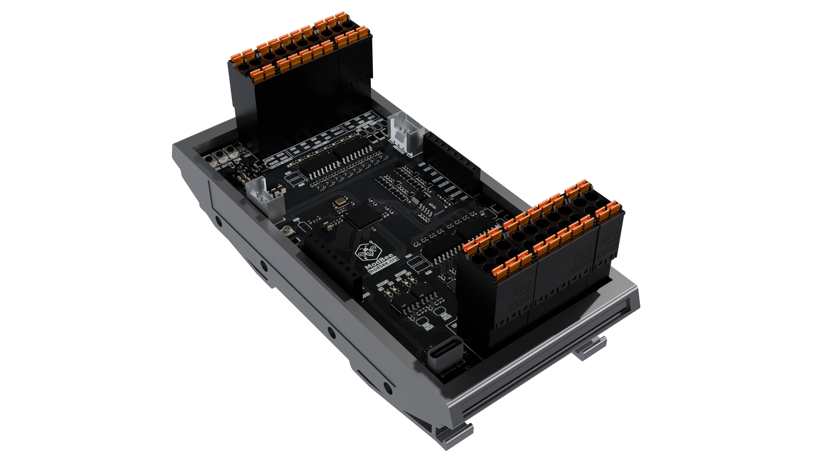

# ModBee Node-UIO
### Modular IoT Controller with Industrial I/O

A powerful, open-source industrial IoT controller built on the **ESP32-S3** platform. The ModBee Node-UIO provides comprehensive digital, analog, and network capabilities for building resilient, decentralized automation and monitoring systems.



## 🎯 Quick Overview

**ModBee Node-UIO** is a modular control device that brings together:

- **8 Digital Inputs (DI)** + **8 Digital Outputs (DO)** - Direct automation signals
- **4 Analog Inputs (AI)** + **2 Analog Outputs (AO)** - Process variables and setpoints
- **Dual Communication**: Modbus RTU (master/slave) + Custom ModBee peer-to-peer protocol
- **Web Interface** - Real-time monitoring and control via HTTP/WebSocket
- **Network Resilience** - Auto-healing mesh networks without single points of failure
- **Industrial Integration** - Seamless connection to PLC, SCADA, and legacy systems

## 🚀 Key Features

### Flexible Operating Modes
- **Standalone**: Local I/O control with web interface
- **Modbus Master**: Control multiple slave devices
- **Modbus Slave**: Integrate with existing control systems
- **ModBee Peer**: Join decentralized self-healing networks

### Professional Capabilities
- ✅ **3-Point Analog Calibration** for voltage/current accuracy
- ✅ **Web-Based Configuration** dashboard
- ✅ **Token-Passing Protocol** for collision-free multi-master networks
- ✅ **Automatic Network Healing** - survives node failures
- ✅ **Industrial-Grade Communication** - RS485 with hardware flow control
- ✅ **JSON Configuration Storage** - persistent settings in LittleFS

### Developer-Friendly
- Arduino IDE compatible
- Comprehensive C++ API
- Example applications included
- Modular library structure

## 📋 Hardware Specifications

| Component | Specification |
|-----------|---|
| **Microcontroller** | ESP32-S3 @ 240 MHz |
| **Digital Inputs** | 8 channels (5 - 24VDC  pnp logic signals) |
| **Digital Outputs** | 8 channels (5 - 24VDC pnp mosfet outputs 500ma max) |
| **Analog Inputs** | 4 channels (16-bit ADC via ADS1115) - 0-10V or 0-20mA |
| **Analog Outputs** | 2 channels (12-bit DAC via ModbeeGP8413) - 0-10V or 0-20mA |
| **Communication Ports** | Modbus UART1 + ModBee UART2 (115200 baud) |
| **Network Interface** | RS485 via hardware serial (2x UART) |
| **Storage** | 4 MB Flash + LittleFS for configuration |
| **Power** | USB-C or external 5 - 24V supply |
| **Dimensions (L × W × H)** | 118 × 58 × 45 mm | Compact form factor for portable applications |
| **Mounting** | DIN Rail Mount | Compatible with standard 35 mm DIN rail systems |

## 🔌 I/O Details

### Mode Configuration
```cpp
// Set analog channel modes via software
io.setADCMode(0, MODE_VOLTAGE);    // AI01: 0-10V → 0-10000 mV
io.setADCMode(2, MODE_CURRENT);    // AI03: 0-20mA → 0-20000 µA
io.setDACMode(0, MODE_VOLTAGE);    // AO01: 0-10V output
io.setDACMode(1, MODE_CURRENT);    // AO02: 0-20mA output
```

### Real-Time I/O Access
```cpp
// Digital I/O
if (io.DI01) io.DO01 = !io.DO01;

// Analog I/O (scaled values in mV/µA)
int voltage = io.AI01_Scaled;       // Current reading
io.AO01_Scaled = 5000;              // Set to 5V
```

## 🌐 Communication Protocols

### Modbus RTU (Master/Slave)
- Industry standard protocol
- Master: Poll multiple slaves
- Slave: Respond to master requests
- Coil/Input registers for digital I/O
- Holding/Input registers for analog I/O

### ModBee Protocol (Peer-to-Peer)
- Decentralized token-passing ring
- Any node can initiate communication
- Automatic network healing on failures
- Dynamic node joining/leaving
- No single point of failure

## 💻 Quick Start

### 1. Installation

**Using PlatformIO:**
```bash
git clone https://github.com/mod-bee/modbee-node-uio.git
cd modbee-node-uio
pio run -e lolin_s3_mini -t upload
```

**Using Arduino IDE:**
1. Install ESP32 board support
2. Select LOLIN S3 Mini as board
3. Load `src/main.cpp`
4. Upload

### 2. Basic Usage

```cpp
#include <ESP32Modbee.h>
#include <ModbeeWebServer.h>

// Initialize controller
ESP32Modbee io(
  MB_NONE,              // or MB_MASTER / MB_SLAVE
  LED_PIN, 37, 38,      // Pins
  18, 17,               // Modbus UART
  1,                    // Modbus ID
  16, 15,               // ModBee UART
  5,                    // ModBee ID
  115200, SERIAL_8N1, &Serial1,
  115200, SERIAL_8N1, &Serial2
);

ModbeeWebServer webServer(io, 80);

void setup() {
  Serial.begin(115200);
  io.begin();
  webServer.begin();
  
  io.setADCMode(0, MODE_VOLTAGE);
  io.setDACMode(0, MODE_VOLTAGE);
}

void loop() {
  io.update();
  webServer.update();
  
  // Your application logic
  io.DO01 = io.DI01;           // Mirror input to output
  io.AO01_Scaled = io.AI01_Scaled;  // Map analog input to output
}
```

### 3. Web Interface

Access the control panel at `http://192.168.4.1/` (default AP mode):

- **Real-time I/O monitoring**
- **Analog calibration configuration**
- **WiFi settings management**
- **Network status display**

## 📚 Documentation

- **[docs/GETTING_STARTED.md](docs/GETTING_STARTED.md)** - Quick setup and getting started guide
- **[docs/HARDWARE.md](docs/HARDWARE.md)** - Complete hardware specifications, pinout, and electrical characteristics
- **[docs/SOFTWARE.md](docs/SOFTWARE.md)** - Comprehensive firmware guide, API reference, and usage patterns
  - Operating modes explained
  - ESP32Modbee API documentation
  - ModBee protocol overview
  - Web server integration
  - Calibration procedures
  - Complete code examples
  - Deployment checklist
- **[docs/API_REFERENCE.md](docs/API_REFERENCE.md)** - Practical code examples and API reference
- **[docs/OPENPLC.md](docs/OPENPLC.md)** - Integration guide for openPLC automation framework
  - Setup instructions with two configuration options
  - Function block reference and parameters
  - Multi-device networking
  - Example programs and best practices

## 📖 File Structure

```
modbee-node-uio/
├── README.md (this file)
├── docs/
│   ├── GETTING_STARTED.md - Quick setup guide
│   ├── HARDWARE.md - Hardware documentation
│   ├── SOFTWARE.md - Software/API documentation
│   ├── API_REFERENCE.md - Practical code examples
│   └── OPENPLC.md - openPLC framework integration
├── src/
│   └── main.cpp - Main application
├── lib/
│   ├── ModbeeNodeFW/
│   │   └── src/
│   │       ├── ESP32Modbee.h/cpp - Core I/O manager
│   │       └── ModbeeWebServer.h/cpp - Web interface
│   ├── ModBeeProtocol/
│   │   └── src/ - Peer-to-peer protocol implementation
│   ├── ArduinoJson/ - JSON configuration
│   ├── ADS1X15/ - 16-bit ADC driver
│   ├── modbus-esp8266/ - Modbus RTU implementation
│   └── (other libraries...)
├── openPLC/
│   ├── projects/
│   │   └── Modbee-Test/ - Pre-configured test project
│   └── function-blocks/ - IEC-61131 function blocks for openPLC
├── examples/
│   ├── standalone-example.ino - Local control only
│   ├── master-example.ino - Master multiple slaves
│   └── slave-example.ino - Slave device
└── data/
    └── www/ - Web interface files
```

## 🔧 Configuration

### Operating Modes

| Mode | Use Case | Configuration |
|------|----------|---|
| **Standalone** | Web interface + local I/O | `io = ESP32Modbee(..., MB_NONE, ...)` |
| **Slave** | Controlled by external master | `io = ESP32Modbee(..., MB_SLAVE, ...)` |
| **Master** | Control multiple slaves | `io = ESP32Modbee(..., MB_MASTER, ...)` |

### Example: Master Reading Slaves

```cpp
// Poll multiple slave devices
void loop() {
  io.update();
  
  for (uint8_t slaveId = 1; slaveId <= 3; slaveId++) {
    // Read digital inputs
    bool inputs[8];
    io.mb.readIsts(slaveId, 0, inputs, 8);
    
    // Write digital outputs
    for (int i = 0; i < 8; i++) {
      io.mb.writeCoil(slaveId, i, inputs[i]);
    }
  }
}
```

## 🌐 ModBee Network Example

Three devices automatically forming a mesh:

```
Device 1 (ID=1) ——— Device 2 (ID=2)
     ↓                    ↓
Device 3 (ID=3) ←————————┘

Token ring: 1 → 2 → 3 → 1 → ...
If device 2 fails, ring auto-heals: 1 → 3 → 1 → ...
```

## 🎓 Code Examples

### Example 1: Simple I/O Mirroring
```cpp
void loop() {
  io.update();
  
  // Mirror all digital inputs to outputs
  for (int i = 1; i <= 8; i++) {
    // Dynamic access (use your preferred method)
  }
  
  // Map analog signals
  io.AO01_Scaled = io.AI01_Scaled;
  io.AO02_Scaled = io.AI02_Scaled;
}
```

### Example 2: Modbus Master Polling
See [docs/SOFTWARE.md](docs/SOFTWARE.md) for detailed master/slave examples.

### Example 3: Web-Enabled Monitoring
See [examples/master-example.ino](examples/master-example.ino)

## 🐛 Troubleshooting

### Connection Issues
- Verify RS485 termination (120Ω resistors at cable ends)
- Check baud rates match between master/slave
- Monitor serial output: `Serial.println("Debug message")`

### Analog Accuracy
- Calibrate ADC/DAC using known reference signals
- Use web interface calibration tool
- Check cable shielding and grounding
- Reduce cable length near analog inputs

### Network Problems
- Verify all devices have unique node IDs
- Check that devices are on same RS485 bus
- Monitor protocol messages at serial port
- See [docs/SOFTWARE.md](docs/SOFTWARE.md) troubleshooting section

## 🤝 Contributing

Contributions welcome! Areas for enhancement:
- Additional communication protocols
- Web interface improvements
- More example applications
- Documentation improvements

## 📝 License

See [LICENSE](LICENSE) file for details.

## 📞 Support

For issues, questions, or suggestions:
1. Check [docs/HARDWARE.md](docs/HARDWARE.md) for hardware issues
2. Check [docs/SOFTWARE.md](docs/SOFTWARE.md) for software/API questions
3. Review [docs/API_REFERENCE.md](docs/API_REFERENCE.md) for Arduino/C++ code examples
4. Check [docs/OPENPLC.md](docs/OPENPLC.md) for openPLC integration questions
5. Review [examples/](examples/) for working code
6. Check troubleshooting sections in documentation

## 🎯 Use Cases

### Industrial & Factory Automation
- **Multi-Station Control** - Coordinate equipment across assembly lines
- **openPLC Integration** - Use as modular distributed I/O for open-source PLCs
- **Legacy System Bridge** - Connect modern sensors/controllers to older industrial equipment via Modbus
- **Quality Assurance** - Real-time monitoring and rejection logic for defect detection
- **Machine Supervision** - Track equipment health, runtime, and predictive maintenance signals

### Building & Facility Management
- **HVAC Control** - Temperature, humidity, and air quality integration with feedback loops
- **Smart Lighting** - Occupancy-based control, daylight harvesting, emergency lighting
- **Security Systems** - Alarm monitoring, door sensors, motion detection, panic buttons
- **Power Management** - Monitor energy consumption, switch loads, UPS integration
- **Access Control** - Door locks, visitor management, zone-based restrictions

### Home Automation & Smart Home
- **Home Assistant Integration** - Direct Modbus connection or via ESPHome bridge
- **ESPHome Compatible** - Use as remote I/O expansion for ESPHome setups
- **Smart Home Hubs** - Local automation without cloud dependency
- **Irrigation & Watering** - Soil moisture sensors, pump control, scheduled watering
- **Garage/Gate Control** - Automatic door operation with obstacle detection

### Sensor Monitoring & Data Logging
- **Environmental Monitoring** - Temperature, humidity, pressure, air quality logging
- **Distributed Sensor Arrays** - Collect data from multiple remote locations
- **Microclimate Tracking** - Greenhouse, warehouse, or storage facility monitoring
- **Water Quality Monitoring** - pH, dissolved oxygen, conductivity, temperature
- **Vibration & Motion** - Equipment monitoring for predictive maintenance
- **Data Buffering** - Local LittleFS storage with cloud sync capability

### Alarm & Safety Systems
- **Multi-Zone Alarm Systems** - Burglar, fire, panic sensors with centralized monitoring
- **Emergency Notifications** - Alert escalation via multiple channels (buzzer, light, network)
- **Fire Safety** - Heat/smoke detector integration with sprinkler/ventilation control
- **Equipment Shutdown Logic** - Safety interlocks and emergency stop functionality
- **UPS Battery Monitoring** - Load switching and disconnection logic

### Wireless & Remote I/O Networks
- **Remote I/O Expansion** - Modbus network extends I/O channels across locations
- **Wireless Gateway** - Use with wireless sensors via Modbus RTU to WiFi bridge
- **LoRaWAN/NB-IoT Bridge** - Connect ModBee network to wide-area IoT networks
- **Portable Monitoring Stations** - Battery-powered field units with WiFi sync
- **Multi-Site Mesh Networks** - ModBee peer-to-peer for auto-healing site networks

### Process & Condition Monitoring
- **PID Control Loops** - Closed-loop setpoint management for temperature/pressure
- **Batch Processing** - State machine automation for production recipes
- **Level Monitoring** - Tanks, reservoirs, hoppers with fill/drain automation
- **Flow Control** - Pump speed, valve position, proportional control
- **Bottling/Packaging** - Label detection, cap torque, fill verification

### Agricultural & Outdoor Applications
- **Precision Farming** - Field sensor networks with autonomous control
- **Livestock Monitoring** - Feeder position, water availability, shelter temperature
- **Crop Protection** - Irrigation scheduling, frost warning, pest detection
- **Weather Station Integration** - Wind speed, rainfall, UV index triggered actions
- **Equipment Fleet Tracking** - Fuel levels, maintenance schedules, geofencing

### Energy & Utility Management
- **Renewable Energy Integration** - Solar/wind monitoring with load switching
- **Smart Metering** - Current/voltage monitoring for energy analytics
- **Battery Management** - Charge/discharge cycling, temperature monitoring
- **Generator Control** - Automatic switchover, load balancing, fuel monitoring
- **Power Distribution** - Circuit protection, overload detection, load shedding

### Specialized Applications
- **3D Printer/CNC Integration** - Filament runout, enclosure monitoring, tool changers
- **Aquaculture/Aquarium** - Water parameters (pH, DO, temp) with feeder automation
- **Food Processing** - Temperature zones, timing cycles, sanitation sequencing
- **Vehicle Charging** - EV charging station control and monitoring
- **Ventilation & Air Density** - Pressure equalization, safety exhaust control

## 📦 Project Information

- **Repository**: mod-bee/modbee-node-uio
- **Platform**: ESP32-S3
- **Language**: C++/Arduino
- **Build System**: PlatformIO recommended (Arduino IDE compatible)
- **License**: (see LICENSE file)

---

