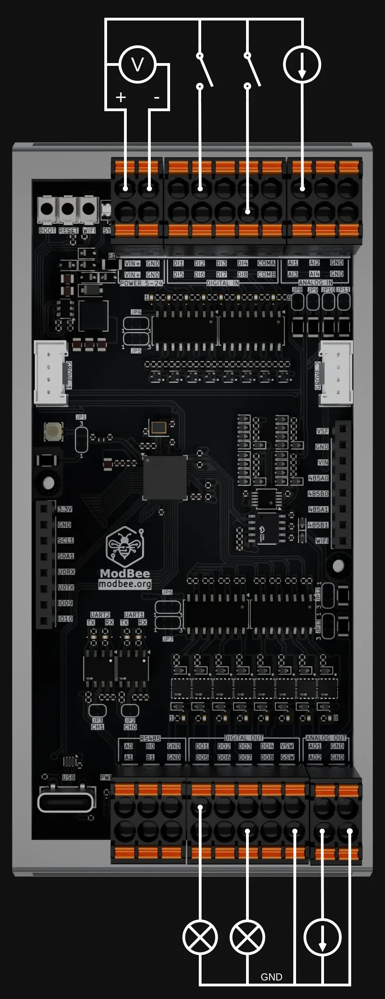

# ModBee Node-UIO Hardware Documentation

## ⚠️ Important: Refer to Schematic PDF for Complete Specifications

**For complete electrical specifications, connector details, and voltage/current specifications, refer to:**
```
../schematics/modbee-node-uio.pdf
```

This document covers GPIO pin mappings and software interfaces. The schematic provides:
- HAT and Groove connector pinouts
- 24VDC digital I/O protection circuits
- 0-10V and 0-20mA analog input/output circuits
- Current ratings and maximum loads
- PCB layout and component identifiers

## Overview

The **ModBee Node-UIO** is a compact industrial IoT controller built on the **ESP32-S3** microcontroller. It provides:
- **8 opto-isolated digital inputs** (5–24 V)
- **8 open-collector digital outputs** (500 mA @ 5–24 V each)
- **4 configurable analog inputs** (0–10 V or 0–20 mA, via ADS1115 16-bit ADC)
- **2 configurable analog outputs** (0–10 V or 0–20 mA, via I2C DAC)
- **Dual RS485 serial interfaces** (Modbus RTU + ModBee peer-to-peer protocol)
- **Wireless connectivity** (802.11 b/g/n Wi-Fi + Bluetooth)
- **Stackable HAT headers** and Grove connectors for expansion
- **3× indicator LEDs** (Green/Red/Blue) and reset/boot buttons
- **5–24 V DC power input** with internal 3.3 V regulation

## Hardware Specifications

### Microcontroller
- **Chip**: ESP32-S3 (with 4 MB Flash)
- **Processor**: Dual-core 32-bit Xtensa @ 240 MHz
- **RAM**: 384 KB SRAM (326 KB available for applications)
- **Flash**: 4 MB
- **Storage**: LittleFS filesystem support (on-board Flash)
- **PSRAM**: Optional (not populated)
- **Antenna**: U.FL connector (chip-antenna footprint not populated by default)
- **Serial Communication**: 
  - USB-C (native Serial0) for programming and debugging
  - UART1 for Modbus RTU (GPIO 18 RX, 17 TX) via RS485 CH1
  - UART2 for ModBee protocol (GPIO 16 RX, 15 TX) via RS485 CH2
- **I2C**: Shared bus (GPIO 37 SDA, 38 SCL) for ADS1115 ADC and DAC
- **Additional GPIO**: Free pins available on HAT headers for expansion

### Power Supply
- **Input Range**: 5–24 V DC via terminal connector (fused) or USB-C
- **USB-C Port (J1)**: Standard USB 2.0 for programming and 5V power supply
- **Fuse**: F1 protects main power input (5–24 V rail)
- **Voltage Regulation**: Synchronous buck converter (U3) generates stable 3.3 V
- **VOUT**: Fused 5–24 V brought to HAT headers (respects F1 rating)
- **Voltage Supervisor**: Monitors 3.3 V supply for device reset logic
- **Typical Current**: 100–150 mA @ 3.3 V (device alone) + 500 mA per digital output @ switched voltage
- **HAT Power Limits**: Do not exceed main fuse rating on VOUT rail

### Programming & Debugging
- **Port**: USB-C (J1)
- **Protocol**: UART0 (standard USB serial)
- **Download Mode**: Hold Boot (SW2) → press Reset (SW1) → release Boot
- **Serial Monitor**: 115200 baud, 8N1
- **LED Indicators**:
  - **Green LED**: MCU operational / heartbeat
  - **Red LED**: Fault indication (voltage supervisor or user-controlled)
  - **Blue LED**: User-controllable status indicator

### Buttons
- **Reset (SW1)**: Momentary switch to EN pin (active low) → MCU reset
- **Boot (SW2)**: Momentary switch to GPIO0 (active low) → download mode when held during reset

### Antenna
- **Connector**: U.FL (HE2) for external antenna
- **Default Configuration**: Chip-antenna footprint **not populated** (factory default)
- **Note**: For wireless use, populate either external U.FL antenna or chip-antenna components (not both)

### Digital Input/Output (DI/DO)

#### Digital Inputs (DI01–DI08)
- **Quantity**: 8 channels (opto-isolated)
- **Input Range**: 5–24 V DC logic signals
- **Configuration**: Two groups (A: DI01-04, B: DI05-08) – each group can be isolated
- **Terminal**: 10-pin connector (J8) with pinout:

| Pin | Signal | Pin | Signal     |
|-----|--------|-----|------------|
| 1   | DI01   | 6   | DI05       |
| 2   | DI02   | 7   | DI06       |
| 3   | DI03   | 8   | DI07       |
| 4   | DI04   | 9   | Common A   |
| 5   | (GND)  | 10  | Common B   |

- **Isolation Bridges**: Cut "bridge 1&2" on sheet 3 to isolate group A or B supply (factory bridged)
- **Modbus Access**: Available as Input Status registers via Modbus RTU

#### Digital Outputs (DO01–DO08)
- **Quantity**: 8 channels (open-collector)
- **Output Range**: 5–24 V DC @ 500 mA per channel maximum
- **Configuration**: Two groups (A: DO01-04, B: DO05-08) – each group can be isolated
- **Terminal**: 10-pin connector (same format as inputs)
- **Isolation Bridges**: Cut "bridge 1&2" on sheet 4 to isolate group supply (factory bridged)
- **Modbus Access**: Available as Coil registers via Modbus RTU
- **Note**: Load between V.Switch (or external supply) and DO pin

### Analog Input/Output (AI/AO)

#### Analog Inputs (AI01–AI04)
- **Quantity**: 4 channels
- **ADC IC**: ADS1115 16-bit I2C converter (default address 0x48)
- **Input Configuration**: Two pluggable terminal connectors (J10/J11)
- **Configurable Modes** (cut bridge to switch per channel):
  - **Voltage Mode**: 0–10 V DC (factory default on each channel)
  - **Current Mode**: 0–20 mA DC (cut "bridge 1&2" on sheet 5)
- **Calibration**: 3-point calibration via web interface stored in LittleFS
- **I2C Bus**: Shared with DAC (GPIO 37 SDA, 38 SCL)
- **Modbus Registers**: Input Registers (0–3 scaled, 4–7 raw values)

#### Analog Outputs (AO01–AO02)
- **Quantity**: 2 channels
- **DAC IC**: External 12-bit DAC via I2C
- **Output Configuration**: Two pluggable terminal connectors (J11)
- **Configurable Modes** (cut bridge to switch per channel):
  - **Voltage Mode**: 0–10 V DC (factory default)
  - **Current Mode**: 0–20 mA DC (cut "bridge 1&2" on sheet 5)
- **Max Drive**: 500 mA output capacity per channel
- **I2C Bus**: Shared with ADC (GPIO 37 SDA, 38 SCL)
- **Modbus Registers**: Holding Registers (0–1 scaled, 2–3 raw values)

### Communication Protocols

#### Modbus RTU (Serial)
- **Port**: UART1 / RS485 CH1 (Serial1)
- **Baud Rate**: 115200 (configurable via parameters)
- **Serial Config**: 8 data bits, No parity, 1 stop bit (8N1)
- **RX/TX Pins**: GPIO 18 (RX), GPIO 17 (TX) → RS485 transceiver
- **Direction Control**: GPIO-driven (see schematic sheet 2 for exact pin)
- **Termination**: 120 Ω resistor footprint **not populated** (see sheet 2)
  - Populate 120 Ω resistor **only at physical bus ends**
  - Multi-drop topology: terminate at first and last node only
- **Role**: Can operate as Master, Slave, or None (when using ModBee network only)

#### ModBee Protocol (Custom Serial)
- **Port**: UART2 / RS485 CH2 (Serial2)
- **Baud Rate**: 115200 (configurable)
- **Serial Config**: 8N1
- **RX/TX Pins**: GPIO 16 (RX), GPIO 15 (TX) → RS485 transceiver
- **Direction Control**: GPIO-driven (see schematic sheet 2)
- **Termination**: 120 Ω resistor footprint **not populated** (see sheet 2)
  - Same termination rules as Modbus
- **Node ID**: Configurable per device (1–254 typically)
- **Transport**: RS485 compatible
- **Topology**: Peer-to-peer token-passing ring network
- **Features**:
  - Decentralized multi-master operation
  - Dynamic network joining
  - Automatic failover and healing
  - Collision-free token-based access

## Connection Diagram



### Connectors & Expansion

#### Grove Connectors (J2, J3)
- **Quantity**: 2× 4-pin standard Grove connectors
- **Voltage**: 3.3 V logic
- **Pin Configuration**: VCC / GND / SDA or GPIO / SCL or GPIO
- **One typically I²C**: Shared with ADC/DAC bus (3.3 V)
- **One typically GPIO/UART**: For additional sensors or modules
- **Purpose**: Easy plug-and-play sensor/module integration

#### Stackable HAT Headers (J4–J7)
- **Quantity**: 4× 2.54 mm pitch stackable headers
- **Voltage Domains**:
  - **VOUT** (fused 5–24 V external supply) – shared via power bus
  - **3.3 V** – from internal regulator
  - **GND** – multiple pins on all headers
- **GPIO Signals**: All free ESP32-S3 GPIO (those not used internally)
- **Power Limits**: 
  - Do **not** exceed main fuse rating on VOUT
  - Individual pins rated for 3.3 V logic levels
- **Application**: Custom expansion boards
- **Silkscreen**: GPIO-to-pin mapping printed directly on PCB

### Configuration: Solder Bridges

The ModBee Node-UIO uses **solder bridges (cut traces)** for hardware configuration. There are no numbered jumpers (JP1/JP2, etc.) – configuration is done by carefully cutting thin copper traces labeled on the schematic.

**How to cut**: Use a sharp hobby knife or rotary tool (Dremel) to carefully sever the thin trace between two pads. To restore, solder a 0 Ω resistor or small wire across the pads.

#### Configuration Table

| Feature | Sheet | Schematic Label | Default State | How to Change |
|---------|-------|-----------------|---------------|---|
| **Digital Inputs Group A Isolation** | 3 | Cut bridge 1&2 to use isolated supply | Bridged (shared) | Cut trace for full isolation of DI01-04 supply |
| **Digital Inputs Group B Isolation** | 3 | Cut bridge 1&2 to use isolated supply | Bridged (shared) | Cut trace for full isolation of DI05-08 supply |
| **Digital Outputs Terminal Isolation** | 4 | Cut bridge 1&2 to use isolated separate supply/GND | Bridged (main) | Cut trace to use separate external supply/GND on 10-pin terminal |
| **Digital Outputs Group A Isolation** | 4 | Cut bridge 1&2 to use isolated supply | Bridged (main) | Cut trace + run separate wire for isolated supply on DO01-04 |
| **Digital Outputs Group B Isolation** | 4 | Cut bridge 1&2 to use isolated supply | Bridged (main) | Cut trace + run separate wire for isolated supply on DO05-08 |
| **AI01 Voltage Mode** | 5 | Cut bridge 1&2 to use 0-10V | 0–20 mA (intact) | Cut trace to switch AI01 to voltage mode (0–10 V) |
| **AI02 Voltage Mode** | 5 | Cut bridge 1&2 to use 0-10V | 0–20 mA (intact) | Cut trace to switch AI02 to voltage mode |
| **AI03 Voltage Mode** | 5 | Cut bridge 1&2 to use 0-10V | 0–20 mA (intact) | Cut trace to switch AI03 to voltage mode |
| **AI04 Voltage Mode** | 5 | Cut bridge 1&2 to use 0-10V | 0–20 mA (intact) | Cut trace to switch AI04 to voltage mode |
| **AO01 Current Mode** | 5 | Default 0–10V, cut bridge 1&2 to use 0–20mA | 0–10 V (intact) | Cut trace to switch AO01 to current mode (0–20 mA output) |
| **AO02 Current Mode** | 5 | Default 0–10V, cut bridge 1&2 to use 0–20mA | 0–10 V (intact) | Cut trace to switch AO02 to current mode |
| **RS485 CH1 Termination** | 2 | RS485 EOL Resistor (120 Ω footprint) | Not populated | Solder 120 Ω SMD resistor **only at cable end** |
| **RS485 CH2 Termination** | 2 | RS485 EOL Resistor (120 Ω footprint) | Not populated | Solder 120 Ω SMD resistor **only at cable end** |
| **Chip Antenna** | 1 | Chip-antenna components | Not populated | Leave blank for external U.FL antenna (recommended) |
| **Voltage Supervisor RST Link** | 2 | RST link | Open | Leave open (factory default) |

**Note**: Analog mode bridges (AI voltage / AO current) can also be changed in software via `setADCMode()` and `setDACMode()` calls, so cutting is optional if software configuration is preferred.

## Pin Configuration

### I2C Interface (For ADC/DAC)
```
SDA: GPIO 37
SCL: GPIO 38
Voltage: 3.3V
Pull-up Resistors: Onboard
Address (ADC): 0x48 (ADS1115)
Address (DAC): I2C module default
```

### Serial UART1 (Modbus / RS485 CH1)
```
RX:  GPIO 18 → RS485 Transceiver RX
TX:  GPIO 17 → RS485 Transceiver TX
RTS: GPIO (see schematic sheet 2 for direction control)
Baud: 115200 (configurable)
```

### Serial UART2 (ModBee / RS485 CH2)
```
RX:  GPIO 16 → RS485 Transceiver RX
TX:  GPIO 15 → RS485 Transceiver TX
RTS: GPIO (see schematic sheet 2 for direction control)
Baud: 115200 (configurable)
```

### Digital I/O Pins
```
DI01-DI08: Internal opto-isolated inputs from 10-pin terminal J8
DO01-DO08: Internal open-collector outputs to 10-pin terminal (same connector)
```

### Status LEDs
```
Green (OK):   GPIO (programmed by firmware for heartbeat)
Red (Fault):  GPIO (voltage supervisor or user control)
Blue (User):  GPIO (user-controllable via setRGB or FastLED)
```

### System Pins
```
Reset (SW1):       EN pin (active low)
Boot (SW2):        GPIO 0 (active low) – Hold during reset for download mode
USB-C (J1):       Serial0 UART for programming + 5V power
Antenna (HE2):    U.FL connector (external antenna recommended)
```

## External Connections

### Power Supply
- **Input**: 5–24 V DC via screw terminal (protected by fuse F1)
- **Alternative**: USB-C (J1) supplies 5 V, can power the device directly
- **Output to Load**: V.Switch (fused 5–24 V) via 10-pin terminal or HAT headers
- **GND Reference**: Multiple GND pins on terminal and headers

### RS485 Network Connections
- **Modbus (RS485 CH1)**:
  - A, B, GND to CAT5e twisted pair + shield
  - Multi-drop termination: Populate 120 Ω resistor **only at each end** of cable run
  - Max 20 nodes typical (distance/speed dependent)

- **ModBee (RS485 CH2)**:
  - Same cabling as Modbus (can share physical bus or use separate)
  - Token-passing protocol: auto-configures, no master needed
  - Mesh network: up to 20+ nodes with automatic failover

### Digital I/O Connections
- **Inputs (DI01–DI08)**: External 5–24 V logic between DI pin + Common (A/B)
- **Outputs (DO01–DO08)**: Load (switched supply to DO pin) → GND or external V.Switch
- **Isolation**: Cut solder bridges on sheet 3 & 4 to isolate supply per group

### Analog Connections
- **Inputs (AI01–AI04)**: Single-ended 0–10 V or 0–20 mA between signal + GND
- **Outputs (AO01–AO02)**: Drive external load with stable 0–10 V or 0–20 mA
- **GND**: Must be common with signal return
- **Mode Switches**: Cut bridge on sheet 5 per channel (voltage ↔ current mode)

### Grove Connectors
- **J2, J3**: Two standard 4-pin Grove ports
- **VCC**: 3.3 V regulated
- **GND**: Signal ground
- **Signals**: I2C (J2 typical) and GPIO/UART (J3 typical, depends on layout)

### HAT Headers
- **J4–J7**: Four 2.54 mm stackable headers (generic expansion format)
- **All signals**: Free GPIO on bottom row
- **Power**: VOUT (5–24V fused) + 3.3V + GND on designated rows
- **Standard**: Generic 2.54 mm header spacing (NOT Raspberry Pi HAT-compatible)
- **Stacking**: Multiple custom expansion boards allowed (verify GPIO conflicts)

### Cable Requirements
- **Modbus RS485**: 
  - Twisted pair A/B + Shield
  - Typical: CAT5e or industrial Profibus cable
  - 120Ω terminating resistor at cable ends (if implementing multi-drop)
  
- **ModBee RS485**:
  - Same as Modbus if running point-to-point or separate bus if running multi-drop

## Calibration and Configuration

### Analog Calibration
Each analog channel (AI and AO) supports three-point calibration:
- **Zero Offset**: Calibration offset for zero point
- **Low Calibration**: Raw value at lower range measurement point
- **High Calibration**: Raw value at upper range measurement point

Calibration data is stored in LittleFS and automatically loaded on startup.

### Web-Based Configuration
The built-in web server provides an interface at `http://<device-ip>/` (or default `http://192.168.4.1/`) for:
- Real-time I/O monitoring
- Calibration adjustment and storage
- WiFi configuration
- Network status monitoring

## Power Supply Recommendations
- **USB Power**: Suitable for lab/bench development
- **Industrial Power Supply**: +24V for field deployment
- **Capacity**: Minimum 500mA for safe operation with all outputs active
- **Regulation**: Use industrial-grade power supplies with filtering
- **Decoupling**: Add 100µF capacitor near [Your device's] power input

## PCB Information

### Schematic
See `../schematics/modbee-node-uio.pdf` for detailed schematic (if available)

## Getting Started with Hardware

1. **Prepare the device**: Flash the firmware (see SOFTWARE.md)
2. **Connect power**: Via USB-C or external supply
3. **Configure pins**: Modify `main.cpp` if using non-standard pins
4. **Test I/O**: Use the web interface or serial console
5. **Integrate with network**: Configure for Modbus master/slave or ModBee peer-to-peer
6. **Calibrate analog**: Use web interface and store calibration data

For detailed firmware and software information, see [SOFTWARE.md](SOFTWARE.md).
